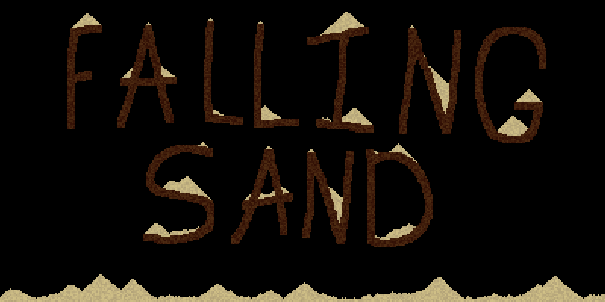

### Intro:
A simple Falling Sand demonstration using C++ and Raylib.\


I plan to add more to this project in the future, including optimisations and different cell types. 

### Running:
Either clone repo or download the appropriate file in /bin

Linux:
```
chmod +x ./FallingSand
```
Windows:
```
double click the exe
```
Of course, running any executable has its risks. If you want peace of mind I recommend compiling from source with the instructions below, after reviewing the code.

### Compiling from source:
Install Raylib and your chosen C++ compiler, I'll give instructions for clang as that's what I use.

#### Linux:
```
pacman -S raylib
pacman -S clang
```
cd into repo
```
mkdir build
cd build
cmake --build .
./FallingSand
```

#### Windows: 
There's likely install commands for these packages on Windows, but unfortunately I'm not familiar with the CLI\
[Raylib](https://www.raylib.com/)\
[Clang](https://clang.llvm.org/get_started.html)

Navigate into the repo in file explorer and type CMD in the explorer search bar
```
mkdir build-mingw
cd build-mingw
cmake -DCMAKE_TOOLCHAIN_FILE=../mingw-toolchain.cmake ..
start FallingSand.exe
```

If there's any issues with these instructions please open an issue so I can correct them :)

### References:
[Raylib](https://www.raylib.com/)
